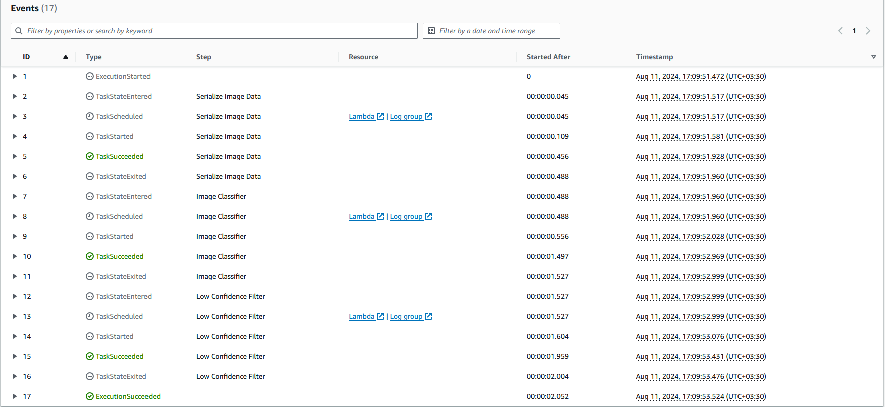
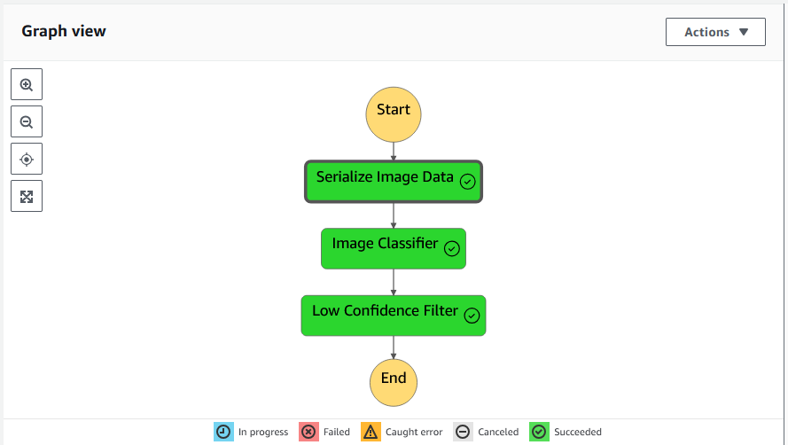

# Udacity ML Workflow For Scones Unlimited On Amazon SageMaker Project
The primary objective of this project was to build and deploy an image classification model for Scones Unlimited, a scone-delivery-focused logistic company, using AWS SageMaker.

# Project: 
Deploy and Monitor a Machine Learning Workflow for Image Classification Using Amazon SageMaker


## 1. Overview
This project was being done as a part of the Udacity and AWS AI/ML Engineer Scholarship 2022 Program.

## 2. Getting Started

### 2.1. Project files related information:

**1. `SconeUnlimited.ipynb`:** The Jupyter notebook demonstrates a complete machine learning workflow for image classification, covering all essential steps. This includes preprocessing the Scones Unlimited image dataset, training the model, deploying it, and monitoring its performance using Amazon SageMaker and other related AWS services.<br><br>

**2. `Lambda.py script`:** This file contains the scripts for three AWS Lambda functions used to create a Step Functions workflow. Each script includes a lambda_handler function, which serves as the entry point for the Lambda function when triggered by an event. The lambda_handler function processes the incoming event and context, executes the main logic of the function—such as interacting with other AWS services, performing calculations, or processing data—and returns a response to the service or client that initiated the Lambda function.<br><br>

**3. `Step Function Screenshot.png`:** Screenshot of Step Functions workflow.<br><br>

**4. `Step-Function-Definition.json`:** JSON exported Step Function<br><br>

### 2.2. Dependencies
```
Python 3 (Data Science) - v3.7.10 kernel
ml.t3.medium instance
Python 3.8 runtime for the AWS Lambda Functions
```

### 2.3. Installation

For local development, you will need to setup a jupyter lab instance.
* Follow the [jupyter install](https://jupyter.org/install.html) link for best practices to install and start a jupyter lab instance.
* If you have a python virtual environment already installed you can just `pip` install it.
```
pip install jupyterlab
```
* There are also docker containers containing jupyter lab from [Jupyter Docker Stacks](https://jupyter-docker-stacks.readthedocs.io/en/latest/index.html).

## 3. Approach:

The project focuses on developing an image classification machine learning model using Amazon SageMaker workflows. It automates key machine learning tasks, including data preparation, model training, deployment, and inference, with the support of AWS Step Functions and Lambda functions.

### 3.1. Individual AWS Lambda functions drafted to build an AWS Step Functions Workflow:<br>

1. The `serialize Image Data` Lambda Function: Receives the URL of an image stored in S3 and returns it as a serialized JSON object.<br>
2. The `Image Classification` Lambda Function: Receives the JSON object from step 1, sends it to an endpoint, and collects the resulting inferences as a JSON object.<br>
3. The `Low Confidence Filter Inferencess` Lambda Function: Receives the inference data from step 2 and filters out only the images that meet the predefined threshold.<br>

### 3.2. Building a State Machine via AWS Step Functions

#### 3.2.1. Execution Flow of the Step Function 



#### 3.2.2. Step Function Graph



## License

[License](LICENSE)
